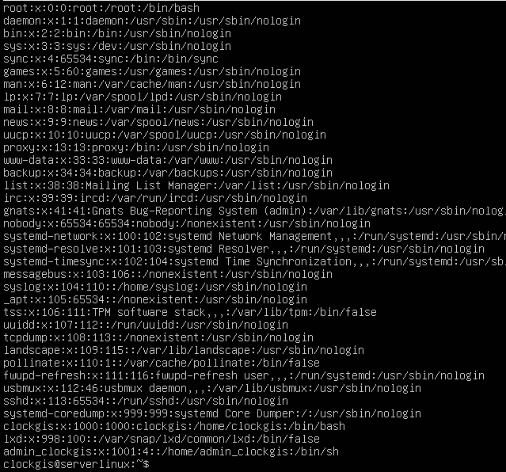
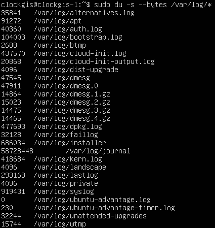
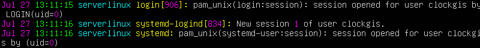

## Part 1. Установка ОС

- ``Проверка версии Ubuntu после установки `` 
 

---

## Part 2. Создание пользователя
- ``Создаём пользователя и назначаем ему группу adm`` 
 

- ``Вывод списка пользователей (добавленный в конце)`` 
 

---

## Part 3. Настройка сети ОС

- ``Задали название машине вида user-1`` 
  

- ``Установили актуальную временную зону и вывели информацию в терминал`` 
 

- ``Установили набор сетевых инструментов`` 
 
``Вывели информацию о сетевых интерфейсах`` 
 
**lo (loopback device)** – виртуальный интерфейс, присутствующий по умолчанию в любом Linux. Он используется для отладки сетевых программ и запуска серверных приложений на локальной машине. С этим интерфейсом всегда связан адрес 127.0.0.1. У него есть dns-имя – localhost.

- ``Используя консольную команду получить ip адрес устройства, на котором вы работаете, от DHCP сервера`` 
 
**DHCP - Dynamic Host Configuration Protocol** - автоматический предоставляет IP адреса и прочие настройки сети (маску сети, шлюз и т.п) компьютерам и различным устройствам в сети.

- ``Узнали внешний IP-адрес`` 
 

- ``Узнали внутренний IP-адрес шлюза, он же ip-адрес по умолчанию`` 
 

- ``Изменили файл /etc/netplan/*.yaml, применили изменения в netplan, перезагрузились`` 
 
 
- ``Проверяем, что адреса соотсветствуют заданным в предыдущем пункте`` 
 
- ``Успешно пропинговали удаленные хосты 1.1.1.1 и ya.ru`` 
 

---

## Part 4. Обновление ОС
- ``Успешно обновили системыне пакеты`` 
 

---

## Part 5. Использование команды sudo
- **sudo** - позволяет временно поднимать привилегии и выполнять задачи администрирования системы с максимальными правами 
``Добавили пользователя в группу с привилегиями sudo, переключились на этого пользователя и поменяли hostname`` 
 

---

## Part 6. Установка и настройка службы времени
- ``Вывод команды с корректным временем`` 
 

---

## Part 7. Установка и использование текстовых редакторов
 
 
 
 
``1) vim test_VIM.txt;``

``2) Режим редактирования: I;``

``3) Выйти из режима редактирования: esc;``

``4) Выход с cохранением: :wq;``

``5) Выход без сохранения: :q;``

``6) Поиск: /текст, который хотим найти;``

`` 7)Замена: :s/<что хотим изменить>/<на что хотим заменить>;``

 
 
 
 
``1) nano test_NANO.txt;``

``2) Выход с cохранением: CTRL + x, затем y и enter;``

``3) Выход без сохранения: CTRL + x, затем n;``

``4) Поиск: CTRL + W, затем enter (alt + w для перехода к след. вхождению, ctrl + c для преращения поиска);``

``5) Замена: CTRL + \ + <что хотим изменить + enter> + <на что хотим заменить + enter> + A(для замены все вхождения) или y и n по отдельности;``

 
 
 
 
``1) joe test_JOE.txt;``

``2) Для выхода без сохранения ^C -> y;``

``3) Для поиска: ^K F -> что ищем -> I;``

``4) Для замены: ^K F -> что заменить -> R -> чем -> Y;``

## Part 8. Установка и базовая настройка сервиса SSHD
- ``Установка cлужбу SSHd`` 
*__sudo apt-get install ssh__* 
*__sudo apt install openssh-server__* 
 
- ``Добавление автостарта службы при загрузке системы`` 
*__-sudo systemctl enable ssh__* 
*__systemctl status ssh__* 
 
- ``Перенастройка cлужбы SSHd на порт 2022`` 
*__sudo vim /etc/ssh/sshd_config__* 
 
*__systemctl status ssh__*  
- ``Команда PS, предназначена для представления о наличии процесса sshd. Флаги приведены ниже`` 
**ps** - показывает запущенные процессы, выполняемые пользователем в окне терминала 
**-e или -А** -показывает все процессы, кроме лидеров сессии 
**-d -N** -можно инвертировать вывод с помощью переключателя -N. Например, если хочу вывести только лидеров сеансов 
**-T** -увидеть только процессы, связанные с этим терминалом 
**-r** -просмотреть все работающие (running) процессы 
**-p 'pid'** -если вы знаете идентификатор процесса PID, вы можете просто использовать следующую команду, для вывода процесса с этим 'pid' 
**-p 'pid1' 'pid2'** 
**U 'userlist'** -найти все процессы, выполняемые конкретным пользователем 
 
- ``Перезагружаем систему``  
- ``netstat -tan`` 
 
**-tan**:  
-a -	Показывать состояние всех сокетов; обычно сокеты, используемые серверными процессами, не показываются. 
-n - Показывать сетевые адреса как числа. netstat обычно показывает адреса как символы. 
-t - Отображать TCP подключения 
**Proto** - Содержит тип протокола 
**Recv-Q** - Счётчик байтов не скопированных программой пользователя из этого сокета. 
**Send-Q** - Счётчик байтов, не подтверждённых удалённым узлом. 
**Local Address** - Адрес и номер порта локального конца сокета. 
**Foreign Address** - Адрес и номер порта удалённого конца сокета. 
**State** - Состояние сокета.  
LISTEN Сокет ожидает входящих подключений.  
SYN_SENT Сокет, находящийся в режиме активной попытки установки подключения. 
0.0.0.0 -  это немаршрутизируемый адрес IPv4, который используется в качестве адреса по умолчанию или адреса-заполнителя.

---

## Part 9. Установка и использование утилит top, htop
- Uptime: 5 min 
- 1 user 
- Общая загрузка системы: 0.00, 0.00, 0.00 
- Общее количество процессов: 96 total 
- Загрузка CPU: 0.1% 
- Загрузка MEM: 160/3920 
- PID процесса, занимающего больше памяти - 1 
- PID процесса, занимающего больше всего процессорного времени - 1361 

-- ``сортировка по PID`` 
 
-- ``сортировка по PERCENT_CPU`` 
 
-- ``сортировка по PERCENT_MEM`` 
 
-- ``сортировка по TIME`` 
 
-- ``фильтр по процессу sshd`` 
 
-- ``поиск процесса syslog`` 
 
-- ``с добавленным выводом hostname, clock и uptime`` 
 

---

## Part 10. Использование утилиты fdisk
- Disk /dev/sda, size: 10 GiB, 10737418240 bytes, 20971520 sectors 
 
- Размер swap равен нулю 
 

---

## Part 11. Использование утилиты df
- bytes
 
- ext4
 

---

## Part 12. Использование утилиты du
- ``du command:`` 
 
- ``Вывести размер папок /home, /var, /var/log (в байтах):`` 
 
- ``Вывести размер папок /home, /var, /var/log (в человекочитаемом виде):`` 
 
- ``Вывести размер всего содержимого в /var/log (не общее, а каждого вложенного элемента, используя *):`` 
 

---

## Part 13. Установка и использование утилиты ncdu
- ``Установка`` 
 
- ``/home`` 
 
- ``/var`` 
 
- ``/var/log`` 
 

---

## Part 14. Работа с системными журналами
- ``/var/log/dmesg`` 
 
- ``/var/log/syslog`` 
 
- ``Последняя авторизация`` 
 
- ``Перезапуск OpenSSH Server`` 
 

---

## Part 15. Использование планировщика заданий CRON
- ``Создание задачи в cron`` 
 
- ``uptime каждые 2 минуты`` 
 
- ``Вывели список задач`` 
 
- ``Удалили все задачи вывели список`` 
 
